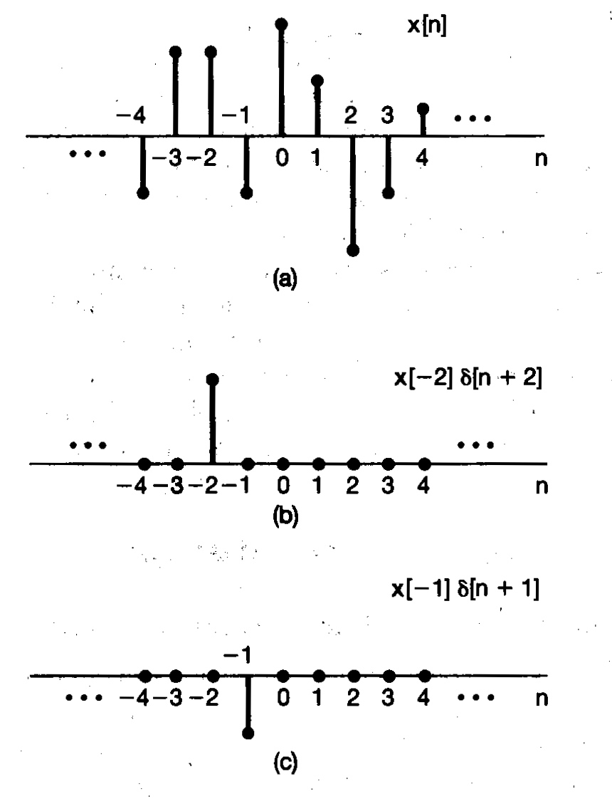

# Proyecto Grupal 2: Diseño de un sistema de control de un ascensor

Mediante el desarrollo de este proyecto, los estudiantes deben generar un sistema ascensor de no menos de 5 pisos. La planta va a estar constituida por un motor de CD y un potenciómetro (u otro sensor pactado con el profesor) para medir el piso en el que está. 

No es necesario coloar un objeto en la cabina del ascensor. La construcción del ascensor es libre y a conveniencia del grupo de trabajo. El sistema completo sería visualizado en la siguiente figura:


Mediante el desarrollo de este proyecto, el estudiante aplicará los conceptos de análisis de señales, 

Atributos relacionados: Análisis de Problemas (AP).

## 1. Estructura General Propuesta

1. `Botones para ascensor:` Son los botones y una cantidad discreta de valores que es relativo a la cantidad de pisos del ascensor.

2. `Comparador:` Se encarga de extraer el error a partir de la diferencia entre el potenciometro (o sensor de medición) y la medición del piso deseado.

3. `Controlador:` Es un controlador PID desarrollado por el grupo de trabajo. Este será implementado en un microcontrolador.

4. `Motor DC:` Motor en corriente directa que sube o baja el ascensor.

5. `Cabina:` Elemento que sube o baja relativo al movimiento del motor DC. La cabina debe ser de al menos un cubo de 10 cm × 10 cm × 10 cm. Procure que cada piso sea de más de 10 cm. Estas medidas pueden ser modificadas con acuerdo previo del profesor.

6. `Pot. 2:` Es el potenciómetro que da la altura del ascensor. Puede ser algún otro pactado anteriormente con el profesor.

El sistema sin controlador muestra un movimiento impreciso que genera movimientos erráticos, el controlador ayudará para que el movimiento sea preciso. El sistema se debe mover rápidamente al punto y no tener errores desde el movimiento actual a la posición deseada.

## 2. Investigación Teórica

### 2.1 ¿Por qué es importante la respuesta al impulso y al escalón para modelar sistemas?

Los `sistemas LTI (Linealmente Independientes en el Tiempo)` son accesibles al análisis por varias razones. Una de ellas es que poseen la priopiedad de `superposición`, permitiendo representar al sistema en términos de una combinación lineal de un conjunto de señales básicas y calcular la salida en términos de sus respuestas a señales básicas. 

Una de las señales básicas más utilizadas es el `Impulso Delta Dirac (impulso unitario)`, tanto discreto como continuo, puesto que las señales en general se pueden representar como la combinación lineal de impulsos retardados. 

Así, es posible realizar una `caracterización completa de cualquier sistema LTI en términos de su respuesta a un impulso unitario`. Esto es llamado la convolución (sumatoria en discreto, integral en continuo)

Esto puede verse a través de la siguiente ecuación llamada `propiedad de selección del impulso unitario discreto`:

```math
x[n] = \sum_{k= - \inf}^{+\inf} x[k] \delta[n-k]            
```

Note que esta ecuación permite representar cualquier función como la suma de impulsos unitarios desplazados donde los pesos o coeficientes de cada impulso unitario es `x[k]`. Si `x[n] = u[n]` se vería de esta forma: 

```math
u[n] = \sum_{k= - \inf}^{+\inf} \delta[n-k]
```

Por ejemplo, observe la siguiente figura que representa una función x[n]. Note que puede representarse en base a impulsos.



Ahora bien, considere una entrada arbitraria `x[n]`, la cuál puede representarse como suma de impulsos (ecuación de propiedad de selección). 
La respuesta al escalón 


La `Transformada Discreta de Fourier (DFT)`:

```
Entrada: Señal en el tiempo x[n]

Salida: Componentes en frecuencia de la señal (magnitud, fases, energía por frecuencia k) X[k]
``` 

En el sistema del proyecto el transmisor captura una señal (por ejemplo, un seno o mezcla de tonos). La señal puede entenderse como una secuencia `discreta`:

```python
𝑥[0],x[1],x[2], ... , x[N-1]
```

La `DFT` transforma esa secuencia discreta en:

```python
X[0],X[1],X[2], ... , X[N-1]
```

Donde `X[k]` es un número complejo (con magnitud y fase) e indica `que tan presente` está la frecuencia `k` en la señal.

Responde a "¿cuánta de la `k` frecuencia hay en la señal?"

R/ Magnitud (qué tan fuerte es la frecuencia), fase (desplazamiento en el tiempo).

Esto es bastante útil porque con `DFT` es posible `descartar` los coeficientes `X[k]` de menor magnitud (compresión), con el fin de tener una transmisión más eficiente de los datos (menor ancho de banda). 

Se descartan los de menor magnitud porque la `energía` está relacionada con $|X[k]|^2$.

Ahora bien, como no se envía toda la señal, se depende de una aproximación de la señal para reconstruirla. Por esta razón hay que medir:

- `MSE` (error cuadrático medio)
- Energía preservada
- Relación señal-error

### 2.2. Pseudocódigo de DFT

La fórmula de la `DFT` corresponde a: 

```math
X[k] = \sum_{n=0}^{N-1} x[n]e^{-j\frac{2\pi}{N}kn}
```

- `x[n]`: señal en el tiempo
- `X[k]`: componente en frecuencia
- `N`: número de muestras
- `k`: frecuencia

Se tiene que cada coeficiente X[k] es de la forma:

```math
X[k] = a + jb
```

donde para cada X[k] se tiene una:

```math
magnitud = \sqrt{a^2 + b^2}
```

```math
fase = tan^{-1}(b/a)
```

Se tiene que la energía total es:
```math
energía = \sum|x[n]|^2
```

y la energia por frecuencia está dada por:

```python
energia_frec = |X(k)^2|
```

Se tiene el siguiente pseudocódigo:

```python
function DFT(x):
    N = len(x)
    X = array de tamaño N (complejos)

    for k desde 0 hasta N-1:
        suma = 0 + 0j

        for n desde 0 hasta N-1:
            angulo = -2 * pi * k * n / N
            suma += x[n] * (cos(angulo) + j*sin(angulo))

        X[k] = suma

    return X
```

### 2.3. Teoría de FFT

La `Transformada Rápida de Fourier (FFT)` es una forma alternativa, un `algoritmo eficiente y rápido` para calcular el mismo resultado que calcula la `DFT`.

La idea general es entender el `DFT` para implementar la `FFT` y obtener obtener los `coeficientes espectrales en tiempo real` de forma más eficiente.

#### Complejidad

- `DFT:` $O(N^2)$
- `FFT:` $O(N log N)$

Note que la complejidad va a marcar una gran diferencia en tiempo de ejecución (razón por la cuál se hace la comparativa de tiempos de ejecución).

### 2.4 Pseudocódigo de FFT

El algoritmo de FFT (Cooley-Tukey) aplica el concepto de `Divide y Vencerás` (`Divide and Conquer`):

1. Divide la señal en partes más pequeñas (índices `n` pares e impares, las cuales son muestras en el tiempo de la señal)

2. Aplica DFTs para ambos.
3. Combina los resultados usando factores complejos.

```math
X[k]=DFT_{pares} +W_{N,k}​⋅DFT_{impares}
```

donde el `twiddle factor` $W_{N,k} = e^{-j\frac{2\pi}{N}kn}$

Se tiene el siguiente pseudocódigo:

```python
# Fast Fourier Transformation 
# Algoritmo radix-2 de Cooley-Tukey
# Sirve para muestreos de potencias de 2 
# (Por ejemplo: fs = 2^12 = 4096 muestras)
function FFT(x):
    N = len(x)

    # 1. Validación
    if N <= 0:
        error("Señal vacía")

    if N == 1:
        return [x[0]]

    if N no es potencia de 2:
        error("FFT requiere N potencia de 2")

    # 2. Separar en pares e impares
    pares = []
    impares = []

    for i desde 0 hasta N-1:
        if i % 2 == 0:
            pares.append(x[i])
        else:
            impares.append(x[i])

    # 3. Llamadas recursivas
    X_pares = FFT(pares)
    X_impares = FFT(impares)

    # 4. Preparar salida
    X = array de tamaño N (complejos)

    # 5. Combinar resultados
    for k desde 0 hasta (N/2 - 1):

        # Factor twiddle
        angulo = -2 * pi * k / N
        W_real = cos(angulo)
        W_imag = sin(angulo)
        W = complejo(W_real, W_imag)

        t = W * X_impares[k]

        # Parte superior
        X[k] = X_pares[k] + t

        # Parte inferior
        X[k + N/2] = X_pares[k] - t

    return X
```

## 3. Compresión y reconstrucción

En esta etapa se aplican técnicas de análisis espectral complejo para determinar cuántas componentes son necesarias para preservar al menos el 95% de la energía total. Todos lo correspondiente a esta etapa se encuentra en el archivo `signal-proc.py`. 

### 3.1. Teoría: Compresión usando FFT

Una vez la señal ha sido transformada al dominio de la frecuencia es posible comprimir la señal reduciendo la información en `X[k]`.

```
Entrada: X[k]
Salida: Xc[k] -> lista reducida
```

Para comprimir la señal hay varios métodos.

1. `Umbral (thresholding)`: Consiste en igualar a 0 cualquier coeficiente cuya magnitud no sea lo suficientemente relevante (en comparación con un valor `T`)

2. `Ordenar y delimitar`: 
Se ordena por magnitud y se elimina `K` cantidad de los coeficientes más pequeños.

3. `Recorte de banda (low-pass)`: Se dejan las frecuencias bajas debido a que contienen la forma general y las altas se consideran como ruido.

En general, el método 3 no es de los mejores debido a que se basa en una suposición de una señal ordinaria. El método 1 es bueno pero depende de un valor `T` que sea óptimo para cada función. La mejor opción es el método 2 pues el `K` puede ser definido en base a la frecuencia.

### 3.2 Implementación: Compresión usando FFT

La implementación de la compresión se puede hacer con cualquiera de los 3 métodos. Se eligió el método 2 para poder relacionarlo directamente con la energía. La relación de Parseval en espacios unitarios puede generalizarse a:

```math
energía = \sum|x[n]|^2 = \sum|X[k]|^2
```

Si no, sería:

```math
energía = \sum|x[n]|^2 = \frac{1}{N}\sum|X[k]|^2
```

Por lo tanto, en ambos dominios la energía total es la misma. De esta forma, es posible mantener el porcentaje de precisión esperado si se tiene el valor de la energía total y un límite que no puede sobrepasarse. Así, se ordenará y delimitará hasta este límite (método 2) con el siguiente pseudocódigo:

```python
function comprimir(x):

    X = fft(x)

    # Energía total
    energia_total = sum(|X[k]|^2)

    limite = 0.95 * energia_total

    # Crear lista de (k, X[k])
    lista = [(k, X[k]) for k in range(N)]

    # Ordenar por magnitud descendente
    lista = sort(lista, key = |X[k]|, descendente=True)

    energia_acumulada = 0
    X_compr = []

    for (k, valor) in lista:

        energia_acumulada += |valor|^2
        X_compr.append((k, valor))

        if energia_acumulada >= limite:
            break

    return X_compr
```

### 3.3 Reconstrucción

Una vez se tiene la lista comprimida `X_compr = [(k, X[k]), ...]`, se requiere reconstruir una señal aproximada en el dominio del tiempo.

La idea es crear un espectro estimado `X_hat` de tamaño `N` inicializado en ceros, copiar en él los coeficientes conservados y aplicar la transformada inversa (`IFFT`).

```
Entrada: X_compr (lista de coeficientes), N
Salida: x_rec[n] (señal reconstruida)
```

#### Pseudocódigo (reconstrucción)

```python
function reconstruir(X_compr, N):

    # Crear espectro completo inicializado en 0
    X_hat = [0+0j] * N

    # Insertar coeficientes conservados
    for (k, valor) in X_compr:
        X_hat[k] = valor

    # Reconstrucción en tiempo
    x_rec = ifft(X_hat)

    return x_rec
```

#### Nota de implementación (IFFT)

En Python se puede implementar `ifft` usando la propiedad:

```math
\operatorname{IFFT}(X) = \frac{1}{N}\overline{\operatorname{FFT}(\overline{X})}
```

Esto permite calcular la inversa reutilizando la FFT.

### 3.4 Métricas y visualización

Para evaluar la aproximación reconstruida `x_rec[n]` con respecto a la señal original `x[n]`, se calculan:

#### Error Cuadrático Medio (MSE)

```math
\operatorname{MSE} = \frac{1}{N}\sum_{n=0}^{N-1}(x[n] - x_{rec}[n])^2
```

#### Energía preservada

Energía en el tiempo:

```math
E_x = \sum_{n=0}^{N-1}|x[n]|^2
```

Porcentaje de energía preservada (en tiempo):

```math
\eta = \frac{\sum|x_{rec}[n]|^2}{\sum|x[n]|^2}
```

Adicionalmente, durante la compresión se usa la energía espectral acumulada $\sum|X[k]|^2$ para determinar cuántos coeficientes se requieren para cumplir el umbral (por ejemplo, 95%).

En cuanto a visualización, se grafica la señal original vs. la reconstruida para observar la similitud en el dominio del tiempo.

### 3.5 Ejecución en Python

El código de esta etapa se encuentra en `proyecto_1/signal-proc.py`.

Ejecutar el demo (seleccionar `simple`, `compleja` o `voz`):

```bash
python proyecto_1/signal-proc.py
```

Dependencias:

- `numpy`
- `matplotlib`


## Bitácora de Implementación

### DFT - 26 y 27 de marzo del 2026

Se implementó una interfaz de usuario en consola para elegir entre 3 señales de prueba (cada una más compleja que la anterior). Se ejecutaron los tests y las gráficas generadas fueron las siguientes:

#### Señal Simple: $ sen(2\pi5t)$


#### Señal Compleja: $ sen(2\pi5t) + sen(2\pi20t) + sen(2\pi60t) + ruido $


#### Señal Voz Emulada: $ sen(2\pi120t) + sen(2\pi250t) + sen(2\pi400t) + ruido $


Los tiempos de ejecución para cada uno fueron los siguientes:

- Test 1:
    - Duración: 0.051191091537475586
    - Error obtenido: 1.9875884663898337e-12
    - Energia de la señal: 63.5000

- Test 2:
    - Duración: 1.67474365234375
    - Error obtenido: 8.915655588602046e-11
    - Energia de la señal: 453.1395

- Test 3:
    - Duración: 6.542662143707275
    - Error obtenido: 7.917881942456733e-11
    - Energia de la señal: 234.6422

### FFT - 27 y 28 de marzo del 2026

